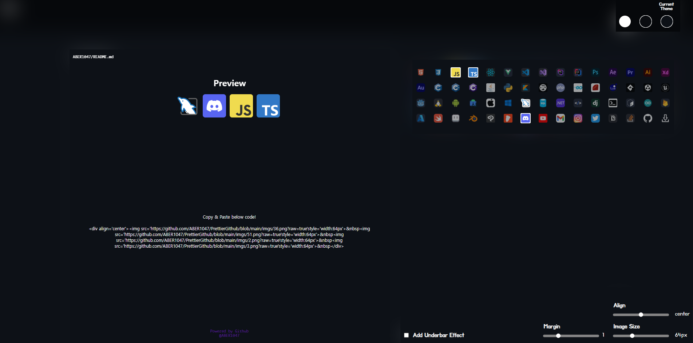

  
  

  ------------------

  ### Prettier Github is a project to make github profile much prettier🥳
  #### 깃허브 프로필을 더 이쁘게 꾸며보세요🥳
  #### This project was developed for people who decorated their profiles with inspiration from my profile design to decorate much easier
  
   

  

  # - Preview

  

      
  

  

|👇With Underbar Effect & no hyperlinked  
<code></code>&nbsp;<code></code>&nbsp;<code></code>&nbsp;<code></code>&nbsp;<code></code>&nbsp;<code></code>
|
|--|

#### 🔗Hyperlinked (none outer box ☒)  
&nbsp;&nbsp;&nbsp;&nbsp;&nbsp;&nbsp;

|🔗Hyperlinked (with outer box ☐)  
&nbsp;&nbsp;&nbsp;&nbsp;&nbsp;&nbsp;&nbsp;&nbsp;&nbsp;&nbsp;&nbsp;&nbsp;&nbsp;&nbsp;&nbsp;&nbsp;&nbsp;&nbsp;
|
|--|

  
    
  # - Index
    
  - <a href = "https://github.com/ABER1047/PrettierGithub?tab=readme-ov-file#guideline">English</a>
    
  - <a href = "https://github.com/ABER1047/PrettierGithub?tab=readme-ov-file#guideline-한국어">한국어</a>

  - <a>日本語</a>

  - <a href = "https://github.com/ABER1047/PrettierGithub?tab=readme-ov-file#guideline-中文">中文</a>

  --------------------------

  # Guideline

  #### 1. Visit <a href = "https://aber1047.github.io/PrettierGithub/">'Prettier Github*'</a> website to design and get codes

    

  #### 2. Click the icons which are on top right to add icons. And You can use additional design settings through the buttons at the bottom right.
  
  

      

  #### 3. To apply the completed design, You should Copy & Paste the left below codes on your github profile (README.md)

   

  --------------------------

  # Guideline [한국어]

  #### 1. <a href = "https://aber1047.github.io/PrettierGithub/">'Prettier Github*'</a> 웹사이트에 접속해주세요.

    

  #### 2. 우측 상단에 있는 아이콘들을 눌러 아이콘을 추가할 수 있습니다. 또한, 우측 하단에 있는 버튼들을 통해 추가적인 디자인 설정이 가능합니다.
  
  

      

  #### 3. 완성된 디자인을 적용하기 위해, 좌측 하단의 코드를 깃허브 프로필(README.md)에 복사-붙여넣기 해주세요. 

   

  --------------------------

  # Guideline [中文]

  #### 1. 访问<a href = "https://aber1047.github.io/PrettierGithub/">'Prettier Github*'</a>网站进行设计并获取代码

    

  #### 2. 点击右上角的图标可添加图标。您可以通过右下角的按钮使用其他设计设置。
  
  

      

  #### 3. 要应用完成的设计，您应该复制并粘贴下面左侧的代码到您的 github 个人资料 (README.md)

   
    
  

